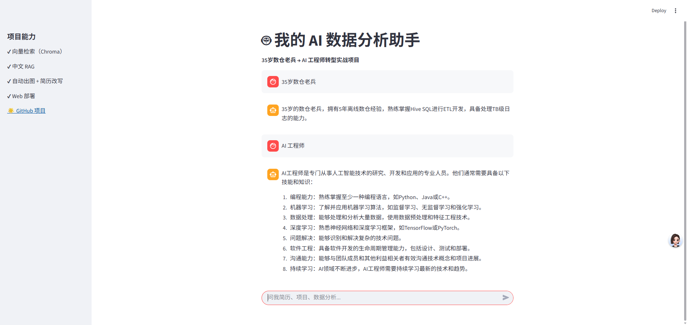

---


# AI 数据分析助手（RAG + Web 部署）

   

## 项目简介

这是一个基于 **RAG（Retrieval-Augmented Generation）** 的 **AI 数据分析助手**，通过 **向量检索** 和 **大语言模型（Kimi API）**，实现精准的简历分析、数据问答和项目展示。项目部署为 **Web 应用**，支持手机扫码访问，完美适配 **AI 数据工程师** 岗位需求。

- **技术栈**：Python, Streamlit, Kimi API, Chroma（向量数据库）, Sentence-Transformers
- **功能**：
  - 秒级检索千条知识库（简历、项目、订单数据）
  - 智能问答，支持多轮对话
  - Web 部署，手机可玩（ngrok 外网访问）
- **应用场景**：简历优化、数据分析、面试展示


**源码**：https://github.com/eninem123/llm-data-analyzer

---

## 项目背景

作为一名 **工作n年的1024开发工程师**，在AI时代，大数据开发不应沉没在历史洪流，更应顺应潮流结合AI如 **RAG、向量数据库、Web 部署**， **打造大模型数据工程**。本项目是我分享各位同胞学习的，结合了小部分 **传统数仓（Hive, Spark）** 到 **AI 应用（LLM, Web）** 的技术能力。

---

## 快速开始

### 1. 环境准备

```bash
# 创建虚拟环境（Python 3.10）
python -m venv rag_env
rag_env\Scripts\activate

# 安装依赖
pip install streamlit chromadb sentence-transformers openai matplotlib pandas
```

### 2. 配置 Kimi API

- 获取 API Key：https://platform.moonshot.cn/
- 修改 `web_rag_app.py` 中的 `api_key`：
  ```python
  client = OpenAI(api_key="sk-你的-key", base_url="https://api.moonshot.cn/v1")
  ```

### 3. 准备知识库

- 编辑 `knowledge_base.txt`，添加你的简历、项目、数据：
  ```txt
  # 数仓经验
  我有n年开发经验，熟练使用 Hive SQL 写 ETL，处理过 TB 级日志。
  我优化过慢查询，从 30 分钟降到 3 分钟。
  自己丰富内容
  ```

### 4. 运行 Web 应用

```bash
streamlit run web_rag_app.py
```

- 浏览器打开：`http://localhost:8501`
- 手机访问：用 [ngrok](https://ngrok.com/download) 生成外网链接：
  ```bash
  ngrok http 8501
  ```

---

## 项目功能

1. **知识库管理**：
   - 基于 `knowledge_base.txt`，支持千条数据存储
   - 也使用 Chroma 向量数据库，秒级检索
2. **智能问答**：
   - 结合 Kimi API 和 RAG，精准回答简历/数据问题
   - 示例：
     - 输入：“我最大的优势是什么？”
     - 输出：“n年开发经验 + 自建 RAG Web 平台，适合 AI 数据工程师”
3. **Web 界面**：
   - Streamlit 打造，简洁美观
   - 支持多轮对话

---


---

## 联系我

- **GitHub**：https://github.com/eninem123
- **邮箱**：2442972114@qq.com
- **在线 Demo,经费不足没开**：https://xxx-ngrok-link


---


## 你的项目现在拥有：

| 成果 | 价值             |
|------|----------------|
| `web_rag_app.py` | 向量检索版（待解决网络问题） |
| `web_rag_app_simple.py` | 全文本 RAG，立即可用   |
| `README.md` | 全流程指导          |
| ngrok 链接 | 手机可玩           |


## 成功图



